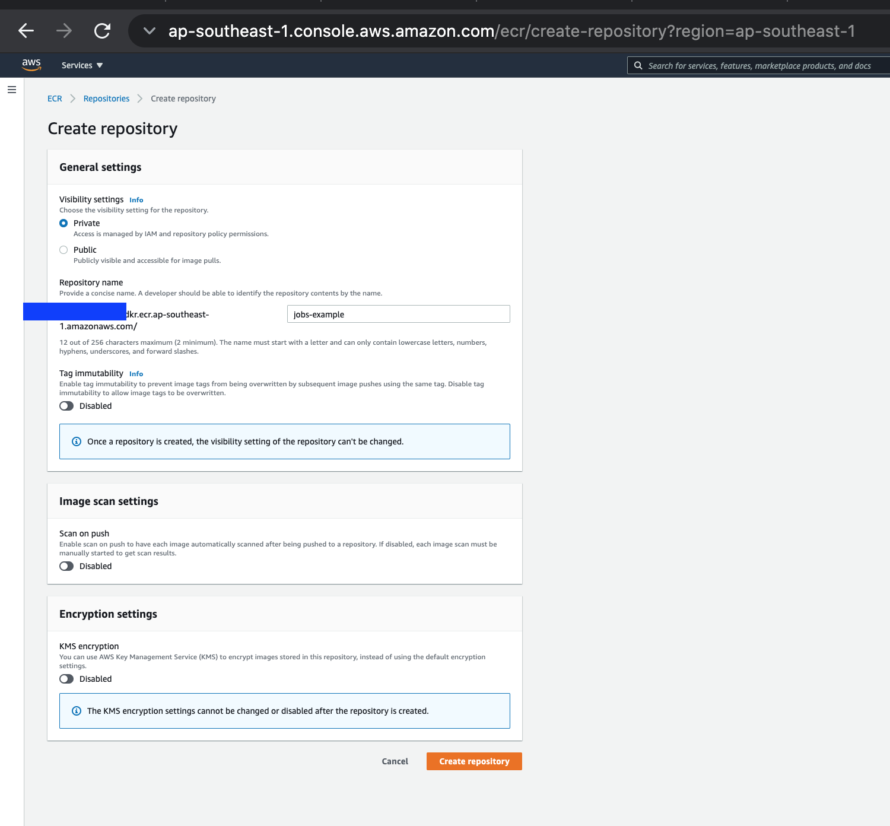
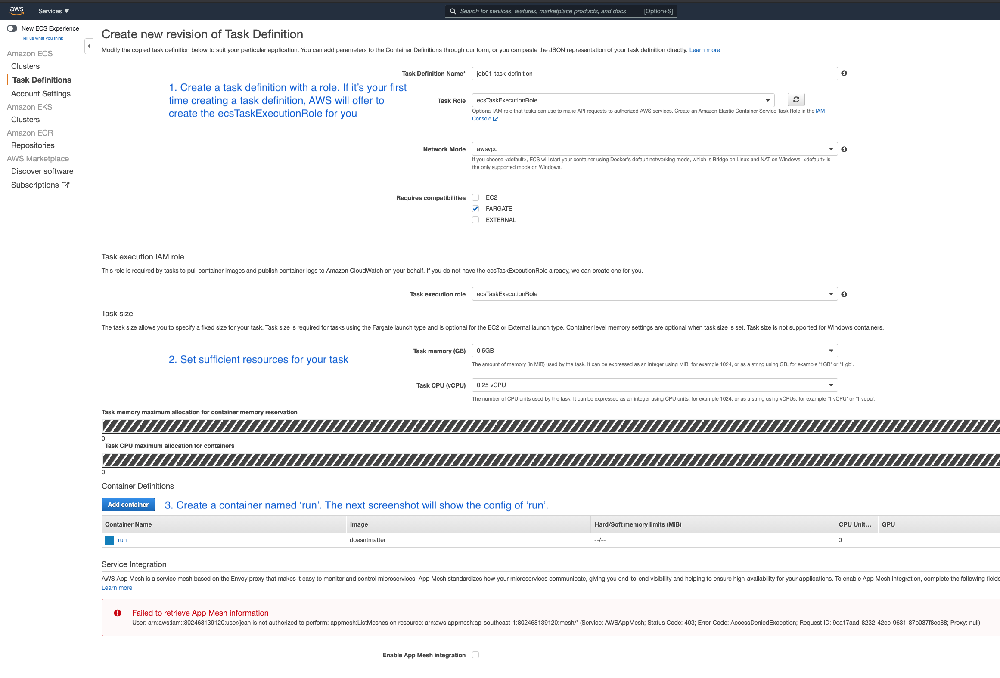
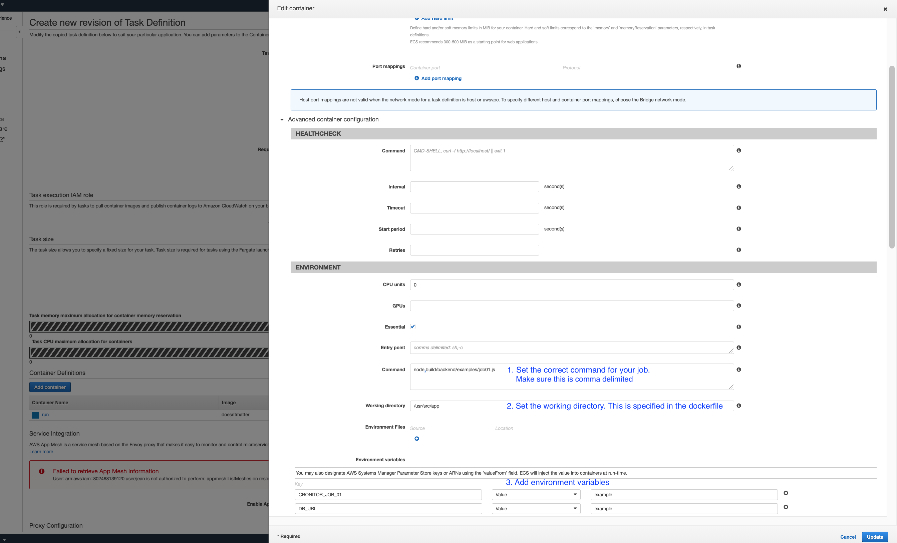
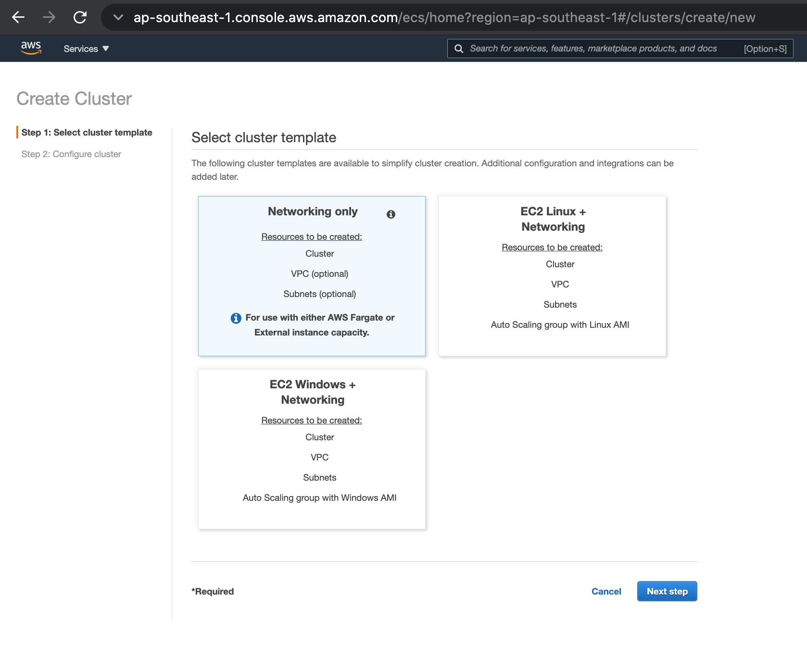
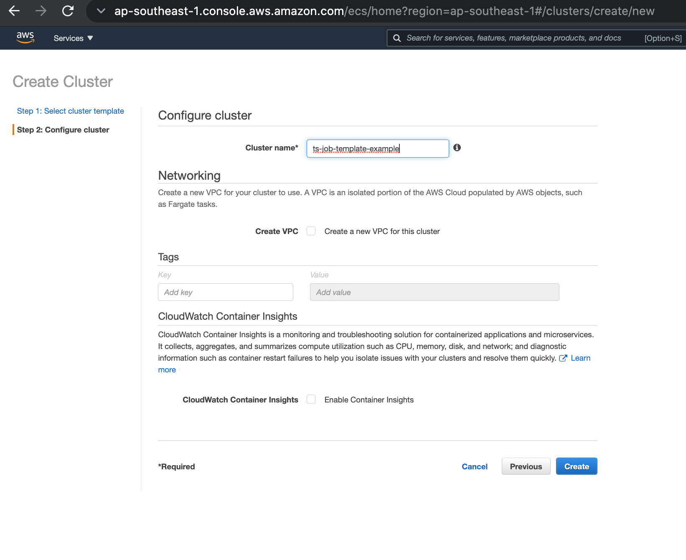
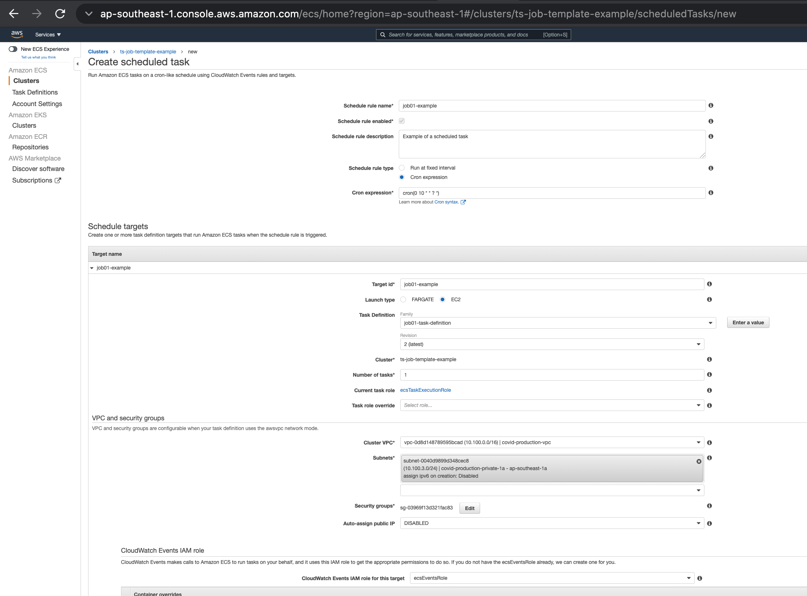
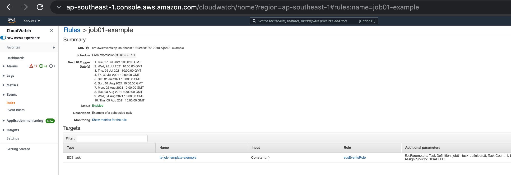
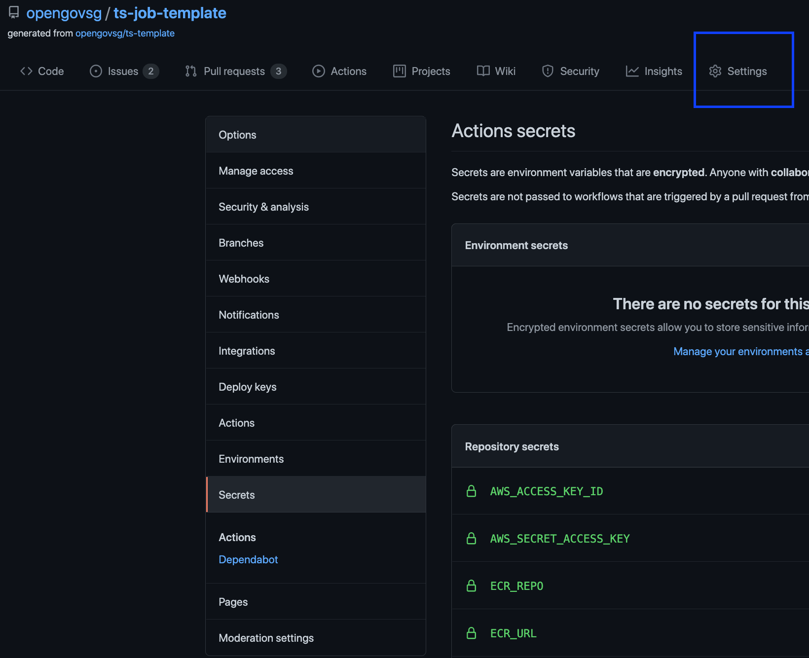
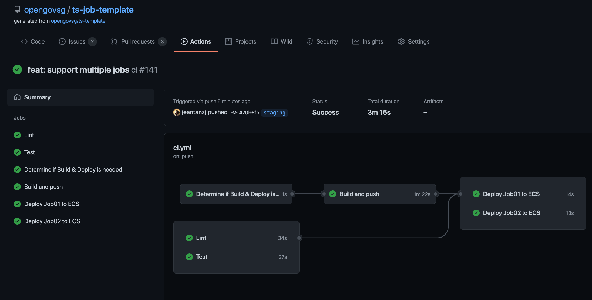

1. Create a repository in Elastic Container Registry (ECR) for your docker images. From here, you'll get the `ECR_URL` (format: aws_account_id.dkr.ecr.region.amazonaws.com) and `ECR_REPO` (the name of your image) environment variables.

2. Create a task definition in Elastic Container Service (ECS). The name of this task definition will be the value of `TASK_DEF_JOB01` (differently named for each job you want to run)

3. Create a cluster in ECS. The name of this cluster will be the value of `ECS_CLUSTER_NAME`

4. Create a scheduled task in that cluster. This will automatically create a cloudwatch event rule that runs your task. Start the name of the target id with `job01-...` -- this is the rule-prefix that is used when deploying the task. The security group and VPC settings can also be set here, should you need to access other resources in your VPC.

5. To deploy, set your environment variables in the github repo. You'll need AWS API keys.

